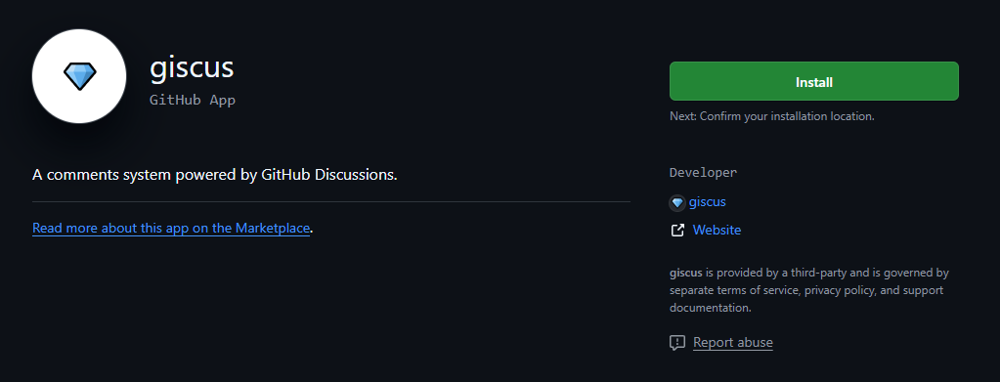
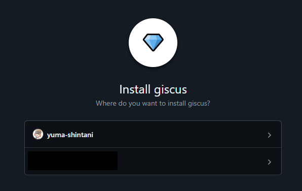
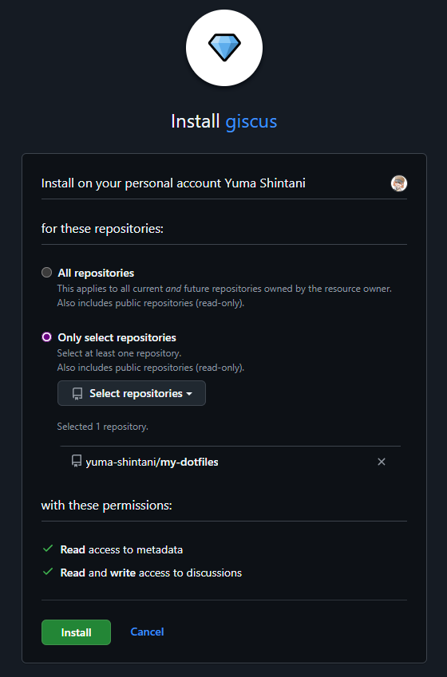
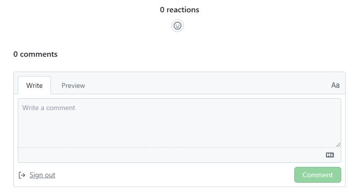

お久しぶりです。私のブログにはコメントやリアクションを付けられる機能が無いので「giscus」を使ってコメント機能を実装してみました。

# giscusとは

GithubのDiscussion機能を活用したコメントシステムです。Githubアカウントがあればコメントやリアクションができるようになります。

https://giscus.app

# giscusの設定

Next.jsでの使用方法

## 1. giscus Appのインストール

1. giscusを導入するリポジトリを公開設定(`public`)にする。

2. 以下のリンクにアクセスしgiscusをインストールする

https://github.com/apps/giscus



3. 対象のユーザを選択する。

   

4. `Only select repositories`を選択し、対象のリポジトリを選択し、`Install`をクリックする。

   

5. `Okay, giscus was installed on the @xxxxxx account.` と出てくれば Installは完了。

## 2. リポジトリのDiscussions機能を有効化する

1. Githubの対象リポジトリに移動する。

2. `Settings`に移動する

3. `General > Features > Discussions`のチェックを有効化する

## 3. giscusの設定を生成する

1. [giscus](https://giscus.app/jp)にアクセスする。

2. giscusの設定を生成する

| 名称                             | パラメータ                                       |
| -------------------------------- | ------------------------------------------------ |
| リポジトリ                       | コメント機能を追加したいリポジトリ               |
| ページとDiscussions連携設定      | Discussionのタイトルにページのpathnameを利用する |
| Discussionで使用するカテゴリ     | Announcements                                    |
| このカテゴリのみを検索します     | 有効化                                           |
| 記事へのリアクションを有効にする | 有効化                                           |
| テーマ                           | カラースキームに従う                             |

# Next.jsのスクリプトに適用する

`@giscus/react`ライブラリを使用しています。  
生成された`script`を参考に設定する。

1. ライブラリをインストールする。

```bash
npm install @giscus/react
```

1. `giscus.jsx`を作成する。  
   `.env`ファイルにリポジトリ名、リポジトリID、カテゴリ、カテゴリIDを定義している。  
   また、Light / Drak Modeに対応させるため、`theme`の部分は可変にしている。

```javascript title="giscus.jsx"
import Giscus from "@giscus/react";
import { useTheme } from "next-themes";
import { useEffect, useState } from "react";

export const Comment = () => {
  const { theme, systemTheme } = useTheme();
  const [giscusTheme, setGiscusTheme] = useState("light");

  useEffect(() => {
    // themeが'system'の場合は、システムのテーマに基づいてGiscusのテーマを決定
    const resolvedTheme = theme === "system" ? systemTheme : theme;

    // Giscusのテーマを設定
    setGiscusTheme(resolvedTheme === "dark" ? "dark" : "light");
  }, [theme, systemTheme]);

  return (
    <Giscus
      id="comments"
      repo={process.env.NEXT_PUBLIC_GISCUS_REPO}
      repoId={process.env.NEXT_PUBLIC_GISCUS_REPO_ID}
      category={process.env.NEXT_PUBLIC_GISCUS_CATEGORY}
      categoryId={process.env.NEXT_PUBLIC_GISCUS_CATEGORY_ID}
      mapping="pathname"
      reactionsEnabled="1"
      emitMetadata="0"
      inputPosition="bottom"
      theme={giscusTheme} // 動的にテーマを変更
    />
  );
};
```

3. `page.jsx`に作成したコンポーネントを追加する。

```js title="page.jsx"
const Giscus = dynamic(() => import("@/app/giscus").then((m) => m.Comment), {
  ssr: false,
});

export default function Home() {
  return (
    <main>
      <Giscus />
    </main>
  );
}
```

4. 以下のように表示される。
   

# 参考にさせていただいたサイト

https://giscus.app

https://blog.k-bushi.com/post/tech/web/instoducing-giscus-with-hugo-stack/

::github{repo="giscus/giscus-component"}
