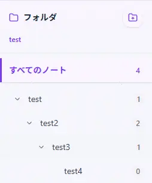
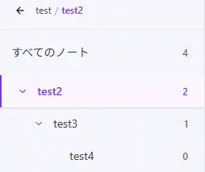
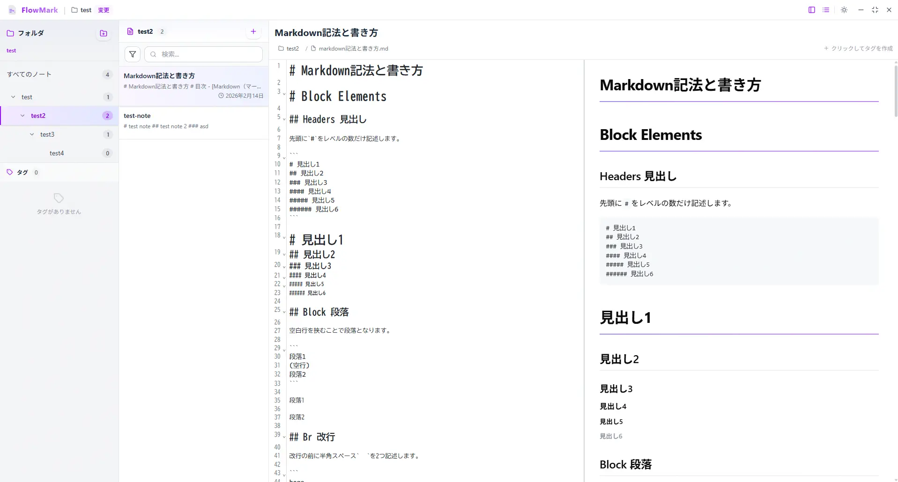
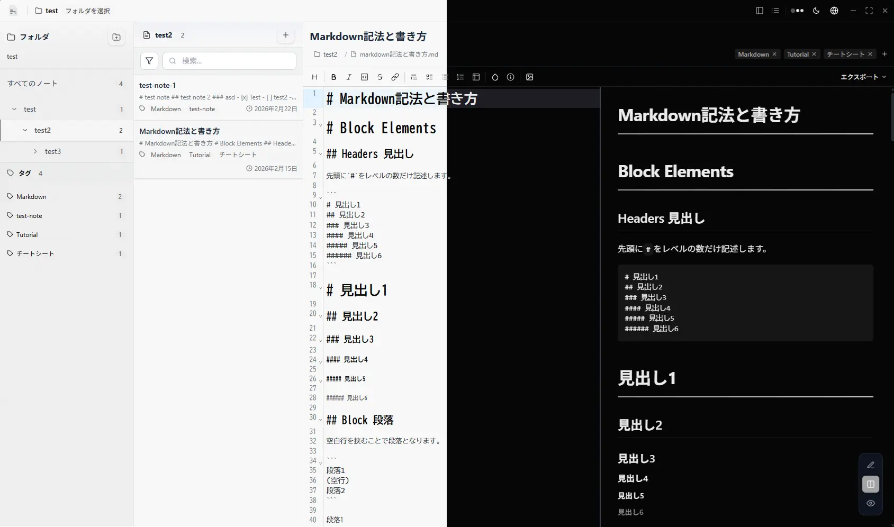
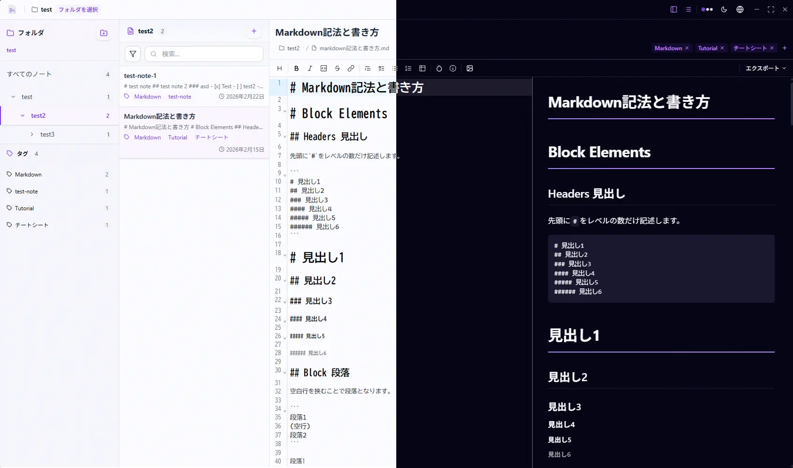

先日、ローカル環境で動作するデスクトップ用の軽量Markdownノートエディタ「Notyra」をリリースしました。
[Work](/work/)でこれまで個人開発してきたプロダクトを紹介していますが、ブログで紹介するのは初めてです。

完全無料(MIT)で公開していますので気軽に利用してみてください。

## Notyraとは？

Notyraは、コンピュータのローカルに保存されたMarkdownファイルを管理できる軽量デスクトップノートエディタです。  
クラウドに保存することなく完全オフライン環境でセキュアに利用することが出来ます。  
また、アプリはオープンソースで公開していますので、完全無料でご利用いただけます。  

https://notyra.y-shin.net

Windows・Mac・Linux向けに、以下のダウンロードページで提供しています。  
お好みのプラットフォーム・形式をご利用ください。
> [!WARNING]
> Notyraは現在アプリ署名がされていないため、セキュリティ警告が表示されることがあります。安全にアプリを起動する方法については、ダウンロードページをご確認ください。
> アプリ署名についてはOSSであれば無償で発行できる機関があるようなので、今後検討していきたいと思います。

https://notyra.y-shin.net/download

## なぜNotyraを作ったのか

元々はメモフォルダを作り、Visual Studio Code上で作成したメモを保存していました。  
しかし、Visual Studio Codeの起動が遅くパッとメモを取りたい時に少しストレスになっていました。  
また、メモを取るのに特化したエディタでは無いのでメモの一覧が見づらいというのもありました。

代替手段を探していたのですが、ほとんどがクラウド同期・単一のマークダウンファイル・ウェブアプリで完全ローカルで動作するデスクトップアプリで良いものが見つかりませんでした。  
良いものが無いのであれば作ってみようと思ったのが開発のきっかけです。

## Notyraの特徴

### 完全ローカル環境で動作
Notyraは外部と接続せず完全ローカル環境で動作します。クラウドへの同期機能もNotyraには備わっていません。  
ノートのバックアップが必要な場合はルートフォルダをご自身で契約頂いているOneDriveやGoogle Driveの同期対象に設定いただくことで自動バックアップが可能です。

### リアルタイムプレビュー
Notyraは3種類のモードでビュアーを切り替えることが出来ます。  
その中でもエディタとプレビューの分割表示に関しては入力した内容がプレビューにリアルタイムで表示されるようになっています。
また、スクロールもエディタとプレビューで同期するようになっています。  
さらに、対象のノートをダブルクリックすることで別ウィンドウで表示・編集することが可能です。

### PDF・HTMLエクスポート
ノートはPDF・HTML形式でエクスポートすることも可能です。

### アプリテーマのカスタマイズ
この辺りは、おまけ機能のようなものですが、アプリの見た目を変えられる機能も提供しています。
ライトモード・ダークモードの切り替えはもちろんのこと、色合いも変更することが出来ます。  
公式としていくつかのテーマを提供していますが、ご自身でテーマを作成して適用させることも出来ます。

### パンくずリスト
Notyraのこだわりポイントですが、サイドバーのフォルダリストで対象の子フォルダや孫フォルダをダブルクリックすると、そのフォルダをトップに持ってくることが可能です。

 

## Notyra UI
ルートフォルダ選択後は以下のような画面に遷移します。

左からサイドバー、ノートリスト、エディタと3つの主要なセクションで構成されています。
- サイドバー : 左側のサイドバーは、フォルダツリーを表示し、ノートの階層的な管理を可能にします。
- ノートリスト : サイドバーの隣には、選択したフォルダ内のMarkdownノートのリストが表示され、簡単にアクセスできます。
- エディタ : 画面の右側には、選択したノートを編集するためのMarkdownエディタが配置されており、リアルタイムでプレビューも可能です。

### 新しいウィンドウでノートを開く
ノートリストで対象のノートをダブルクリックすると新しいウィンドウでエディタを開くことが出来ます。  
複数のノートを行き来する時に便利です。

### アプリテーマ
まず、テーマ切り替えとしてライトモード・ダークモードを提供しています。

さらに、デフォルトテーマとして「グレー」と「パープル」の2種類を提供しています。

#### カスタムテーマ
デフォルトテーマ以外に、公式テーマとして4種類のカスタムテーマを提供しています。
詳しくは以下のNotyraドキュメントページをご覧ください。  

https://notyra.y-shin.net/docs/theme/custom-theme

## 技術的なお話
ここから先はNotyraの中身に興味がある方向けです。

### フレームワーク
元々v1ではElectronで開発していましたが、アプリ自体の容量が大きく起動も遅いためv2からはフレームワークをTauriに変更しました。  
ElectronからTauriに変更したことでCPU使用率も低く、メモリ消費も40MB程度で抑えることが出来ました。  
アプリ容量も数百MBから15MB程度まで減らすことが出来、個人的には満足しています。

https://v2.tauri.app/ja/start/

### 画像の扱い方
Notyraでは画像の描画もサポートしています。
画像の挿入方法は以下の3種類をサポートしています。
1. ドラッグ&ドロップ (複数可)
2. クリップボードから (コピペ)
3. 画像挿入ボタンからの挿入 (複数可)

画像の扱い方はかなり悩みました。ローカルで動作させるにはルートディレクトリ内で画像を管理する必要があるためです。  
チャッピー(Chat GPT)と壁打ちしながら方法を考えた結果、ルートディレクトリ内に画像専用のディレクトリ(image)を作成し、Markdownファイルの中で利用されている画像のみをimageディレクトリの中に保存することにしました。
`Ctrl + Z`で変更を戻す、貼り付け場所を誤る、間違った画像をアップロードするといった動作も多いと思うので、アプリの終了操作をしたタイミングで画像ファイルのクリーンアッププロセスを走らせ、Markdownファイル内で使用されていない画像を削除することにしました。

### レンダリング速度
ノートリストには仮想スクロール(react-virtual)を導入しています。
1万を超えるノートもスムーズに描画することが出来ます。

https://github.com/TanStack/virtual

## まとめ

今回はTauriでデスクトップアプリを開発してみたというお話でした。  
久しぶりのデスクトップアプリの開発でしたが、生成AIが優秀で昔のようにGoogleで数十のタブを開きながら開発というのはなくなりましたね。

Tauriは軽量かつ高速で、個人開発のデスクトップアプリのフレームワークとしては非常に優秀だと感じました。  
Electronからの移行で体感できるほどパフォーマンスが改善されたのは純粋に嬉しかったです。

Notyraはフィードバックがあれば機能追加・改善を続けていく予定です。  
もし使ってみて気になった点や要望があれば、コメントやGitHubのIssueでお気軽にお声がけください。

では、また。